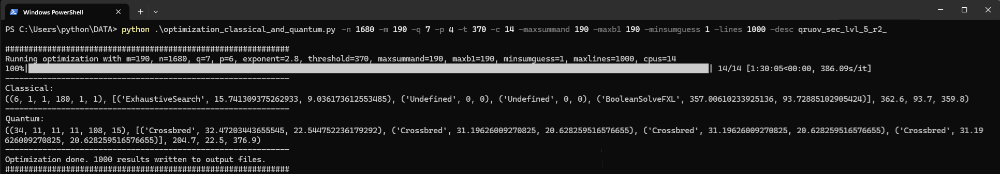

# Just Guess!
This is the implementation of the algorithms described in the paper Just Guess: Improved Algorithm for the Underdetermined MQ Problem.
***

## Transformation Algorithm

Our algorithm `transformation.sage` takes as input:
- `n` number of variables;
- `m` number of equations;
- `q` the characteristic of the field $\mathbb{F}_q$;
- `k` number of guessed coordinates;
- `p` the number of MQ $(1,1)$. 

Note that the `k` and the `p` must satisfy the constraints in the paper.

`transformation.sage` then generates a random MQ map with $P:\mathbb{F}^n_q\rightarrow\mathbb{F}^m_q$ described by a list of matrices and then computes the change of variables $S:\mathbb{F}^n_q\rightarrow\mathbb{F}^n_q$ and the system transformation $T:\mathbb{F}^m_q\rightarrow\mathbb{F}^m_q$ as described in Section 3 of the paper.
It will print all the matrices of the new MQ map $\tilde P = T\circ P\circ S$.

An example:

- `./sage ./transformation.sage -n 11 -m 6 -q 16 -k 2 -p 2`
  
***

## Complexity given $p$ and $k$

Our algorithm `complexity_withpoly.py` takes as input the following parameters:
- `n` number of variables;
- `m` number of equations;
- `q` the characteristic of the field $\mathbb{F}_q$;
- `k` the number of guessed variables;
- `p` the number of MQ $(1,1)$ problems;
- `polyfactors` an optional switch.

The algorithm then evaluates the complexity of the Just-Guess-Solver with the corresponding inputs. If `polyfactors` is called, it computes the complexity including the polynomial overhead. Then, it prints
- the probability $s_p$;
- the number of expected nodes in the MQ tree $e_p$ visited by the DFS;
- the complexity;
both classically and quantumly.

For our algorithm the library `njit` is additionally required.

- `python .\complexity_withpoly.py -n 860 -m 78 -q 16 -p 25 -k 34 --polyfactors`
***

## Test Probability and Expectation

This algorithm, called `prob_exp_test.py` takes as input the following parameters:
- `q` the characteristic of the field $\mathbb{F}_q$;
- `p` the number of MQ $(1,1)$;
- `attempts` the number of experiments we want to conduct,
and returns the experimental probability $s_p$ and the experimental expectation $e_p$.

To run the algorithm from the terminal, run for example

`python prob_exp_test.py -q 16 -p 25 -attempts 10000`.

***

## Optimization Algorithm

Our optimization algorithm `optimizationm.py` takes as input the following parameters:
- `n` number of variables;
- `m` number of equations;
- `q` the characteristic of the field $\mathbb{F}_q$;

The algorithm exhaustively searches for the optimal choice of the parameters $(k,p)$. Then, it prints
- the optimal parameters found excluding polynomial factors;
- the optimal parameters found including polynomial factors;
- the probability $s_p$;
- the number of expected nodes in the MQ tree $e_p$ visited by the DFS;
- the complexity without polynomial factors;
- the complexity with polynomial factors;
both classically and quantumly.

### Prerequisites

For our algorithm the library `njit` is additionally required.

- `python .\optimization.py 860 78 16`
  ***

## Just-Guess-Solver

Our algorithm `just_guess_solver.sage` takes as input:
- `n` number of variables;
- `m` number of equations;
- `q` the size of the field $\mathbb{F}_q$;
- `k` number of guessed coordinates;
- `p` the number of MQ $(1,1)$. 

The solver will to solve a random instance of the MQ problem with $n$ equations, $m$ equations over $\mathbb{F}_{q}$. If no solution is found, the solver solves a re-randomized instance. Eventually, it outputs the solution and checks that $P(y) = t$, together with the number of re-randomization needed.

An example:

- `./sage ./just_guess_solver.sage 50 10 2 3 6`

## Hashimoto and Hashimoto Quantum

The scripts `hashimoto.py` and `hashimoto_quantum.py` have to be substituted to the script `hashimoto.py` in the MQ estimator https://github.com/Crypto-TII/CryptographicEstimators. Precisely, the path is `cryptographic_estimators/MQEstimator/MQAlgorithms`.

Our first script adds the second constraint needed to carry out Hashimoto's transformation, which is missing in the original script. 

The second script allows to etimate the quantum complexity of Hashimoto's algorithm.

Example usage:

`>>> from cryptographic_estimators.MQEstimator.MQAlgorithms.hashimoto_quantum import Hashimoto`

`>>> from cryptographic_estimators.MQEstimator.mq_problem import MQProblem`

`>>> E = Hashimoto(MQProblem(q = 16, m = 78, n = 860)).time_complexity()`
